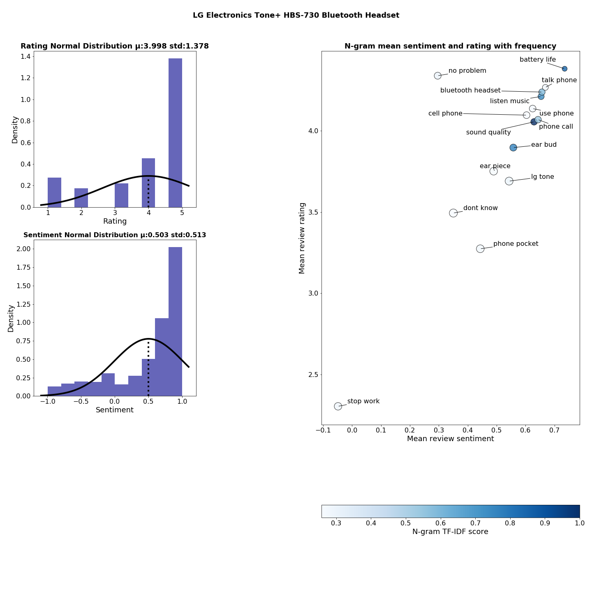

# Big Data Parallell Programming Project
This is my project for the course *Big Data Parallell Programming* during my studies as Halmstad University. 
The goal was to extract useful data from an Amazon Customer Review Data set and present the general opinion of a product, with the product owner as the main target group for observation. 
You can read my project report [here](https://github.com/AndreasH96/BDPP_Project/blob/master/BDPP_Project_Report.pdf).
The result for a product will look as shown below through an interactive plot with Jupyters interact widget. 

